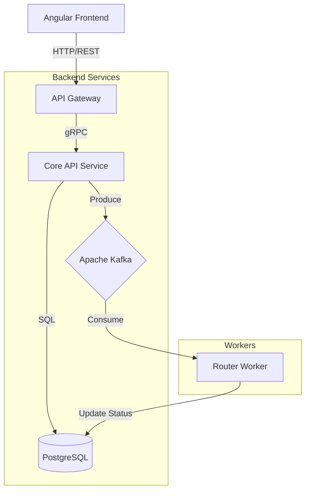

# Chat4All - Sistema de Mensagens Distribuído

Bem-vindo ao **Chat4All**, um sistema de mensagens instantâneas distribuído desenvolvido com foco em escalabilidade, desacoplamento e comunicação assíncrona. Este projeto utiliza uma arquitetura de microsserviços moderna, combinando APIs REST, comunicação gRPC de alta performance e processamento de eventos com Apache Kafka.

## 🏗️ Arquitetura do Projeto

O sistema foi projetado seguindo os princípios de **Microsserviços** e **Event-Driven Architecture**. Abaixo, detalhamos os componentes principais e suas responsabilidades:

### Diagrama de Componentes



### Componentes

1.  **Frontend (Angular 17)**
    *   Interface de usuário moderna e responsiva.
    *   Comunica-se exclusivamente com o API Gateway via HTTP/REST.
    *   Gerencia autenticação (JWT) e estado da aplicação.

2.  **API Gateway (PHP 8.3 + Nginx)**
    *   Ponto único de entrada para o frontend.
    *   Atua como um adaptador, convertendo requisições REST (JSON) em chamadas gRPC (Protobuf).
    *   Expõe endpoints na porta `8000`.

3.  **Core API Service (PHP 8.3 + gRPC)**
    *   O "coração" do sistema. Implementa a lógica de negócios.
    *   Hospeda servidores gRPC para:
        *   **AuthService**: Login e Registro.
        *   **ConversationService**: Criação e listagem de chats (privados e grupos).
        *   **MessageService**: Envio e recuperação de mensagens.
    *   Persiste dados no PostgreSQL e publica eventos de novas mensagens no Kafka.
    *   Roda na porta `50051`.

4.  **Apache Kafka & Zookeeper**
    *   Backbone de mensageria assíncrona.
    *   Garante que o processamento pesado (roteamento, notificações futuras) não bloqueie o envio da mensagem.
    *   Tópico principal: `messages`.

5.  **Router Worker (PHP)**
    *   Serviço de background que consome mensagens do Kafka.
    *   Simula o roteamento e entrega da mensagem, atualizando o status no banco de dados (de `SENT` para `DELIVERED`).

6.  **PostgreSQL**
    *   Banco de dados relacional para persistência de usuários, conversas e mensagens.

---

## 📂 Estrutura do Repositório

A organização das pastas reflete a separação de responsabilidades:

```
chat4all/
├── api-gateway/          # Serviço Gateway (REST -> gRPC)
│   ├── public/           # Entry point (index.php)
│   └── Dockerfile
├── frontend/             # Aplicação Angular
│   ├── src/              # Código fonte (Components, Services)
│   └── Dockerfile
├── services/
│   └── api-service/      # Microsserviço Core (gRPC Server)
│       ├── src/Grpc/     # Implementação dos serviços gRPC
│       ├── src/Database/ # Camada de acesso a dados
│       └── Dockerfile
├── workers/
│   └── router-worker/    # Worker consumidor do Kafka
│       └── src/
├── shared/               # Código compartilhado
│   ├── proto/            # Definições .proto (Contratos)
│   └── generated/        # Código PHP gerado pelo protoc
├── scripts/              # Scripts de automação (start, stop, test)
└── docker-compose.yml    # Orquestração dos containers
```

---

## 🚀 Como Iniciar o Projeto

Siga os passos abaixo para rodar o ambiente completo localmente usando Docker.

### Pré-requisitos

*   **Docker** e **Docker Compose** instalados.
*   **Git** para clonar o repositório.

### Passo a Passo

1.  **Clone o repositório:**
    ```bash
    git clone https://github.com/halysschreiner/chat4all.git
    cd chat4all
    ```

2.  **Prepare os scripts de execução:**
    Dê permissão de execução para os scripts auxiliares:
    ```bash
    chmod +x scripts/*.sh
    ```

3.  **Inicie os serviços:**
    Utilize o script de inicialização que cuidará de subir os containers na ordem correta:
    ```bash
    ./scripts/start.sh
    ```
    *Alternativamente, você pode usar `docker-compose up -d --build`.*

4.  **Aguarde a inicialização:**
    O sistema pode levar alguns instantes para iniciar completamente (especialmente o Kafka e o banco de dados). O script `start.sh` fará verificações de saúde (health checks).

### Acessando a Aplicação

*   **Frontend (Web UI):** Acesse [http://localhost:9000](http://localhost:9000) no seu navegador.
*   **API Gateway:** Disponível em [http://localhost:8000](http://localhost:8000).

---

## 🧪 Testando a API

O projeto inclui um script automatizado para validar os principais fluxos da API (Login, Envio de Mensagem, Listagem).

Para rodar os testes:
```bash
./scripts/test-api.sh
```

Se tudo estiver correto, você verá logs coloridos indicando o sucesso de cada operação, confirmando que a comunicação entre Gateway, Service, Banco e Kafka está fluindo perfeitamente.

---

## 🛠️ Tecnologias Utilizadas

*   **Linguagem Backend:** PHP 8.3
*   **Framework Frontend:** Angular 17
*   **Protocolo RPC:** gRPC (Google Remote Procedure Call)
*   **Mensageria:** Apache Kafka
*   **Banco de Dados:** PostgreSQL 16
*   **Infraestrutura:** Docker & Docker Compose
*   **Servidor Web:** Nginx

---

## 📝 Notas de Desenvolvimento

*   **Protobuf:** As definições de interface estão em `shared/proto`. Qualquer alteração nesses arquivos requer a regeneração do código PHP (via `protoc`).
*   **Persistência:** O banco de dados utiliza a extensão `uuid-ossp` para geração de IDs únicos distribuídos.
*   **Escalabilidade:** A arquitetura permite escalar horizontalmente os workers e os serviços gRPC conforme a demanda aumenta.
