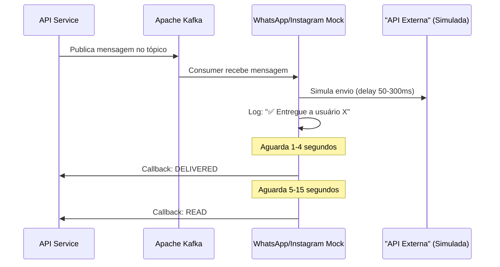
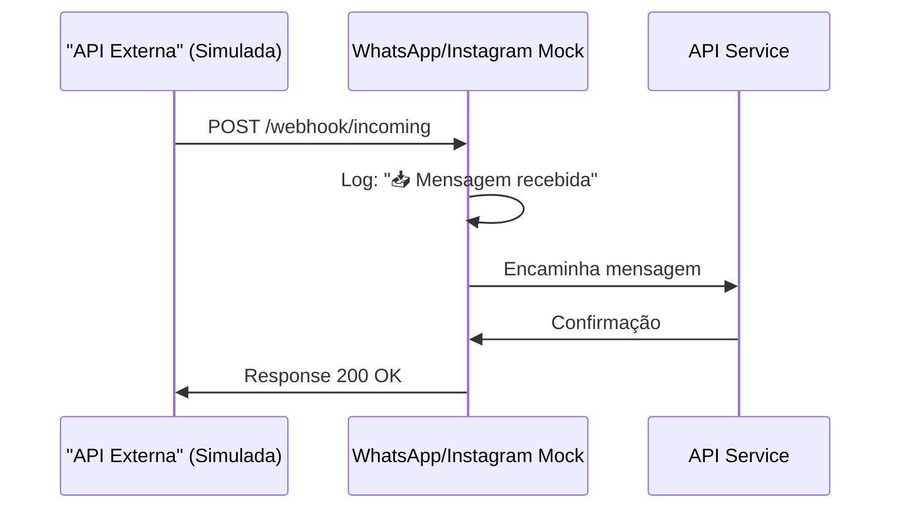

# Conectores Mock - Chat4All

Este diretório contém os conectores simulados (mock) para integração com plataformas de mensageria externas.

## 📦 Conectores Disponíveis

### 1. WhatsApp Mock (`whatsapp-mock`)
Simula a integração com a API do WhatsApp Business.

**Porta:** 8081  
**Tópico Kafka:** `whatsapp.messages`

### 2. Instagram Mock (`instagram-mock`)
Simula a integração com a API do Instagram Direct.

**Porta:** 8082  
**Tópico Kafka:** `instagram.messages`

---

## 🏗️ Arquitetura

Cada connector possui:

### 1. **Consumer Kafka**
- Consome mensagens do tópico específico do canal
- Processa mensagens de forma assíncrona
- Simula delays de rede realistas

### 2. **API HTTP** (Slim Framework)
- **GET `/health`**: Health check do connector
- **POST `/webhook/incoming`**: Recebe mensagens simuladas do canal externo
- **POST `/send`**: Endpoint de teste para simular envio manual

### 3. **Simulação de Callbacks**
Cada connector simula os seguintes eventos:

1. **SENT** - Mensagem enviada (imediato)
2. **DELIVERED** - Mensagem entregue (1-4s depois)
3. **READ** - Mensagem lida (5-15s depois)

---

## 🚀 Como Funciona

### Fluxo de Envio de Mensagem



### Fluxo de Recebimento de Mensagem



---

## 📝 Formato de Mensagens

### Mensagem no Kafka (Enviada pelo Backend)

```json
{
  "message_id": "uuid-da-mensagem",
  "to": "+5511999999999",
  "text": "Olá, como vai?",
  "conversation_id": "uuid-da-conversa",
  "timestamp": 1234567890
}
```

### Callback de Status (Enviado pelo Connector)

```json
{
  "message_id": "uuid-da-mensagem",
  "status": "DELIVERED",
  "timestamp": 1234567890,
  "connector": "whatsapp"
}
```

---

## 🧪 Testando os Conectores

### 1. Verificar Health Check

```bash
# WhatsApp
curl http://localhost:8081/health

# Instagram
curl http://localhost:8082/health
```

### 2. Simular Envio Manual

```bash
# WhatsApp
curl -X POST http://localhost:8081/send \
  -H "Content-Type: application/json" \
  -d '{
    "to": "+5511999999999",
    "text": "Teste de mensagem"
  }'

# Instagram
curl -X POST http://localhost:8082/send \
  -H "Content-Type: application/json" \
  -d '{
    "to": "@usuario_instagram",
    "text": "Teste de mensagem"
  }'
```

### 3. Simular Recebimento de Mensagem

```bash
# WhatsApp
curl -X POST http://localhost:8081/webhook/incoming \
  -H "Content-Type: application/json" \
  -d '{
    "from": "+5511999999999",
    "text": "Olá, preciso de ajuda"
  }'

# Instagram
curl -X POST http://localhost:8082/webhook/incoming \
  -H "Content-Type: application/json" \
  -d '{
    "from": "@usuario_instagram",
    "text": "Olá, preciso de ajuda"
  }'
```

---

## 📊 Logs

Os conectores geram logs coloridos e informativos:

```
🚀 WhatsApp Mock Connector Consumer starting...
✅ Subscribed to topic: whatsapp.messages
🔄 Waiting for messages...

[WhatsApp] 📥 Mensagem recebida do Kafka {"message_id":"abc123","to":"+5511999999999"}
[WhatsApp] ✅ Entregue a usuário +5511999999999 {"message_id":"abc123","text":"Olá!"}
[WhatsApp] 📬 Callback: DELIVERED {"message_id":"abc123","to":"+5511999999999","timestamp":"2025-11-24 20:30:45"}
[WhatsApp] 👁️ Callback: READ {"message_id":"abc123","to":"+5511999999999","timestamp":"2025-11-24 20:30:55"}
```

---

## 🔧 Configuração

As variáveis de ambiente disponíveis:

| Variável | Padrão | Descrição |
|----------|--------|-----------|
| `KAFKA_BROKER` | `kafka:9093` | Endereço do broker Kafka |
| `BACKEND_CALLBACK_URL` | `http://api-service:8080/v1/callbacks/{connector}` | URL para enviar callbacks |

---

## 🛠️ Desenvolvimento

### Estrutura de cada connector:

```
connector-{nome}/
├── composer.json          # Dependências PHP
├── Dockerfile            # Imagem Docker
├── start.sh             # Script de inicialização
├── consumer.php         # Entrypoint do consumer Kafka
├── public/
│   └── index.php       # API HTTP (Slim)
└── src/
    ├── KafkaConsumer.php    # Lógica de consumo do Kafka
    └── MessageProcessor.php  # Processamento e simulação
```

### Adicionando um novo connector:

1. Copie a estrutura de um connector existente
2. Ajuste os namespaces em `composer.json` e classes PHP
3. Modifique os delays e logs conforme características do canal
4. Adicione ao `docker-compose.yml`:

```yaml
connector-{nome}:
  build:
    context: .
    dockerfile: connectors/{nome}-mock/Dockerfile
  container_name: chat4all-connector-{nome}
  ports:
    - "808X:808X"  # Escolha uma porta livre
  environment:
    KAFKA_BROKER: kafka:9093
    BACKEND_CALLBACK_URL: http://api-service:8080/v1/callbacks/{nome}
  depends_on:
    kafka:
      condition: service_started
  networks:
    - chat4all-network
```

---

## 📚 Próximos Passos

- [ ] Implementar endpoints de callback no backend (`/v1/callbacks/{connector}`)
- [ ] Adicionar suporte a anexos (imagens, vídeos, documentos)
- [ ] Implementar rate limiting simulado
- [ ] Adicionar métricas e monitoramento
- [ ] Simular erros e falhas (timeout, API indisponível, etc.)
