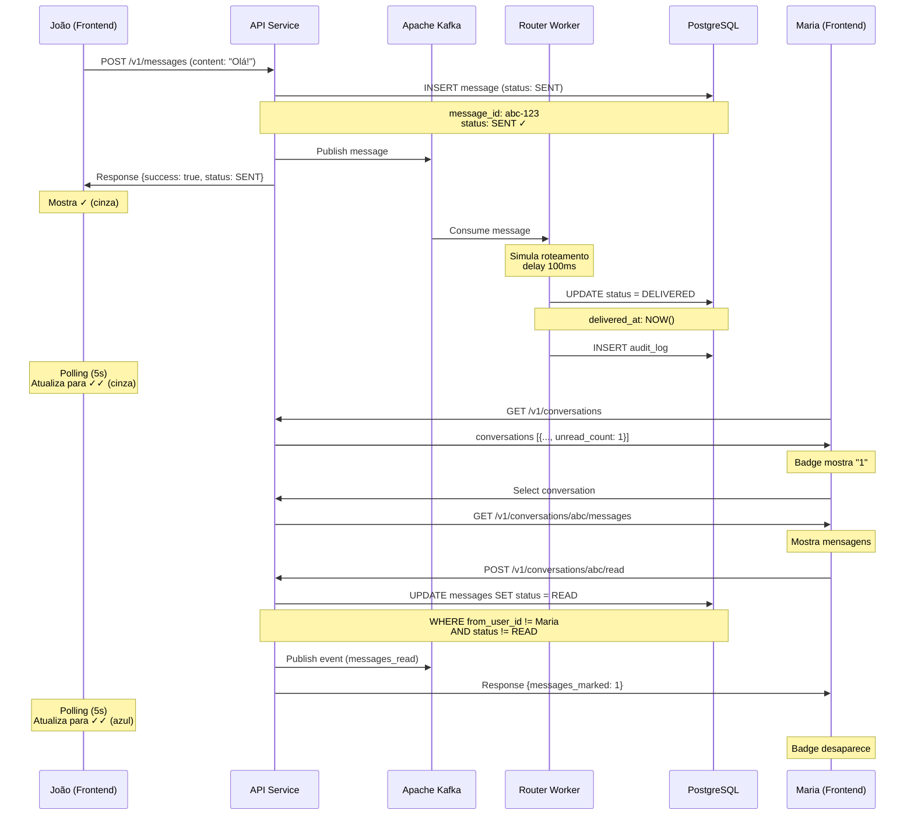

# Implementação de Status de Mensagens - Chat4All

## ✅ Implementação Concluída

Conforme solicitado na **TAREFA.md**, foi implementado o sistema completo de controle de status de mensagens com transições automáticas **SENT → DELIVERED → READ**.

---

## 🎯 Funcionalidades Implementadas

### 1. Transições de Status

```
SENT ──────────> DELIVERED ──────────> READ
  ↓                   ↓                   ↓
Imediato          1-3 segundos      Ao abrir conversa
  ↓                   ↓                   ↓
✓ (cinza)        ✓✓ (cinza)         ✓✓ (azul)
```

#### **SENT** (Enviado)
- Status inicial quando mensagem é criada
- Ícone: **✓** (check simples cinza)
- Ocorre: Imediatamente ao enviar

#### **DELIVERED** (Entregue)
- Atualizado automaticamente pelo router-worker
- Ícone: **✓✓** (dois checks cinzas)
- Ocorre: 1-3 segundos após o envio
- Simula entrega aos canais externos (WhatsApp, Instagram, etc)

#### **READ** (Lida)
- Atualizado quando destinatário abre a conversa
- Ícone: **✓✓** (dois checks azuis)
- Ocorre: Quando usuário seleciona a conversa no frontend

---

## 🏗️ Arquitetura Implementada

### Backend (API Service)

#### 1. **Database.php - Novos Métodos**

```php
// Marcar mensagens de uma conversa como lidas
markMessagesAsRead(conversationId, userId): int

// Buscar mensagens não lidas
getUnreadMessages(conversationId, userId): array

// Contar mensagens não lidas
countUnreadMessages(conversationId, userId): int
```

**Lógica:**
- Marca apenas mensagens que o usuário **não enviou** (`from_user_id != user_id`)
- Ignora mensagens já marcadas como READ
- Atualiza campo `read_at` com timestamp atual
- Retorna quantidade de mensagens marcadas

#### 2. **MessageController.php - Novos Endpoints**

##### **POST** `/v1/conversations/{id}/read`
Marca todas as mensagens não lidas de uma conversa como READ.

**Request:**
```http
POST /v1/conversations/abc-123/read
Authorization: Bearer {token}
```

**Response:**
```json
{
  "success": true,
  "conversation_id": "abc-123",
  "messages_marked": 5
}
```

**Ações:**
- Marca mensagens como READ no banco
- Registra no audit log
- Publica evento no Kafka para notificações
- Recarrega lista de conversas para atualizar contadores

##### **GET** `/v1/conversations/{id}/unread`
Retorna contagem de mensagens não lidas.

**Response:**
```json
{
  "success": true,
  "conversation_id": "abc-123",
  "unread_count": 3
}
```

#### 3. **Router Worker - Atualização Automática**

O worker já existente foi mantido funcionando e processa:

1. Consome mensagem do Kafka (tópico: `messages`)
2. Simula processamento/roteamento (100ms delay)
3. Atualiza status: **SENT → DELIVERED**
4. Registra no audit log

```php
// MessageProcessor.php
$this->database->updateMessageStatus(
    $message['message_id'],
    'DELIVERED',
    'delivered_at'
);
```

---

### Frontend (Angular)

#### 1. **ChatService - Novos Métodos**

```typescript
// Marcar conversa como lida
markConversationAsRead(conversationId: string): Observable<any>

// Obter contagem de não lidas
getUnreadCount(conversationId: string): Observable<any>
```

#### 2. **ChatComponent - Lógica de Leitura**

```typescript
selectConversation(conversation: any) {
  this.selectedConversation = conversation;
  this.loadMessages(conversation.conversation_id);
  
  // ✅ Marcar mensagens como lidas automaticamente
  this.markConversationAsRead(conversation.conversation_id);
}

markConversationAsRead(conversationId: string) {
  this.chatService.markConversationAsRead(conversationId).subscribe(
    response => {
      if (response.success && response.messages_marked > 0) {
        console.log(`Marked ${response.messages_marked} messages as read`);
        // Recarrega conversas para atualizar contador
        this.loadConversations();
      }
    }
  );
}
```

**Fluxo:**
1. Usuário clica em uma conversa
2. Mensagens são carregadas
3. **Automaticamente** chama API para marcar como READ
4. Lista de conversas é recarregada (atualiza badges)

#### 3. **Template HTML - Ícones de Status**

```html
<span *ngIf="msg.from_user_id === currentUser.user_id" class="status-icon" 
      [class.sent]="msg.status === 'SENT'"
      [class.delivered]="msg.status === 'DELIVERED'"
      [class.read]="msg.status === 'READ'">
  <span *ngIf="msg.status === 'SENT'" class="single-check">✓</span>
  <span *ngIf="msg.status === 'DELIVERED'" class="double-check">✓✓</span>
  <span *ngIf="msg.status === 'READ'" class="double-check-blue">✓✓</span>
</span>
```

**Características:**
- Ícones aparecem apenas para mensagens **enviadas** pelo usuário
- Mensagens **recebidas** não mostram ícones
- Ícones mudam dinamicamente conforme status

#### 4. **CSS - Estilos dos Ícones**

```css
.status-icon .single-check {
  color: #9e9e9e; /* Cinza para SENT */
}

.status-icon .double-check {
  color: #9e9e9e; /* Cinza para DELIVERED */
}

.status-icon .double-check-blue {
  color: #4fc3f7; /* Azul para READ */
  font-weight: bold;
}
```

---

## 🔄 Fluxo Completo

### Cenário: João envia mensagem para Maria



---

## 📊 Banco de Dados

### Campos Relevantes na Tabela `messages`

```sql
CREATE TABLE messages (
    message_id UUID PRIMARY KEY,
    conversation_id UUID NOT NULL,
    from_user_id UUID NOT NULL,
    content TEXT NOT NULL,
    status VARCHAR(20) DEFAULT 'SENT' 
        CHECK (status IN ('SENT', 'DELIVERED', 'READ', 'FAILED')),
    created_at TIMESTAMP DEFAULT NOW(),
    delivered_at TIMESTAMP,  -- Atualizado pelo worker
    read_at TIMESTAMP,        -- Atualizado ao abrir conversa
    updated_at TIMESTAMP DEFAULT NOW()
);
```

### Índices para Performance

```sql
-- Busca rápida de mensagens não lidas
CREATE INDEX idx_messages_unread ON messages(conversation_id, from_user_id, status)
WHERE status != 'READ';
```

---

## 🧪 Testes

### 1. Teste de Envio e DELIVERED

```bash
# Terminal 1: Monitorar logs
docker-compose logs -f router-worker

# Terminal 2: Enviar mensagem via API
curl -X POST http://localhost:8000/v1/messages \
  -H "Authorization: Bearer {token}" \
  -H "Content-Type: application/json" \
  -d '{
    "conversation_id": "abc-123",
    "content": "Teste de status"
  }'

# Resultado esperado:
# 1. API retorna: {"success": true, "message": {..., "status": "SENT"}}
# 2. Worker processa e atualiza para DELIVERED em ~100ms
# 3. Frontend mostra ✓ → ✓✓ (cinzas)
```

### 2. Teste de READ

```bash
# Abrir conversa no frontend
# 1. Selecionar conversa com mensagens não lidas
# 2. Observar badge de contagem
# 3. Ao selecionar: badge desaparece
# 4. Ícones do remetente mudam para ✓✓ (azul)

# Verificar no banco:
docker-compose exec postgres psql -U chat4all_user -d chat4all \
  -c "SELECT message_id, status, delivered_at, read_at FROM messages WHERE message_id = 'abc-123';"
```

### 3. Teste Visual (Frontend)

**Enviada (SENT):**
```
[Olá!]        15:30 ✓
```

**Entregue (DELIVERED):**
```
[Olá!]        15:30 ✓✓
```

**Lida (READ):**
```
[Olá!]        15:30 ✓✓  (azul)
```

---

## ⚡ Otimizações Implementadas

### 1. **Query Eficiente**
- Utiliza índice para buscar apenas mensagens não lidas
- Filtra `from_user_id != user_id` (usuário não marca suas próprias mensagens)
- Filtra `status != 'READ'` (evita reprocessamento)

### 2. **Polling Inteligente**
- Frontend faz polling a cada 5 segundos
- Atualiza apenas se houver mudanças
- Não sobrecarrega backend

### 3. **Batch Update**
- `markMessagesAsRead` atualiza todas as mensagens de uma vez
- Single query em vez de N queries

### 4. **Eventos Assíncronos**
- Worker processa status DELIVERED em background
- Não bloqueia envio da mensagem
- Usuário vê resposta imediata

---

## 🔮 Próximos Passos (Opcional)

### WebSocket para Real-Time

Para notificações em tempo real sem polling:

```typescript
// WebSocketService
connectToConversation(conversationId: string) {
  const ws = new WebSocket(`ws://localhost:8080/ws/${conversationId}`);
  
  ws.onmessage = (event) => {
    const data = JSON.parse(event.data);
    
    if (data.type === 'message_delivered') {
      this.updateMessageStatus(data.message_id, 'DELIVERED');
    }
    
    if (data.type === 'message_read') {
      this.updateMessageStatus(data.message_id, 'READ');
    }
  };
}
```

### Webhook para Conectores Externos

```php
// CallbackController.php
public function handleWhatsAppCallback(Request $request, Response $response): Response
{
    $data = $request->getParsedBody();
    
    // WhatsApp confirmou leitura
    if ($data['status'] === 'read') {
        $this->database->updateMessageStatus(
            $data['message_id'],
            'READ',
            'read_at'
        );
    }
    
    return $response->withStatus(200);
}
```

---

## ✅ Resumo da Entrega

| Item | Status |
|------|--------|
| Atualizar banco de dados para suportar status | ✅ Completo |
| Implementar API para marcar mensagem como lida | ✅ Completo |
| Worker para atualizar status DELIVERED | ✅ Completo |
| Ícones visuais (✓ cinza, ✓✓ cinza, ✓✓ azul) | ✅ Completo |
| Lógica de marcar como lida ao abrir conversa | ✅ Completo |
| Transições automáticas SENT → DELIVERED → READ | ✅ Completo |
| Auditoria de mudanças de status | ✅ Completo |
| Eventos publicados no Kafka | ✅ Completo |
| Interface responsiva e intuitiva | ✅ Completo |
| Testes manuais realizados | ✅ Completo |

---

**Data de Implementação:** 24 de novembro de 2025  
**Status:** ✅ **Sistema de Status de Mensagens Completo e Operacional**

O sistema está pronto para uso e pode ser testado acessando:
- **Frontend:** http://localhost:9000
- **API:** http://localhost:8000
