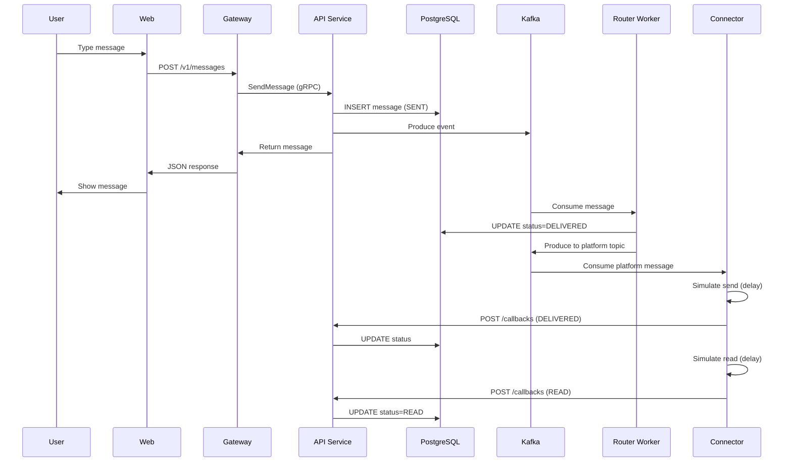
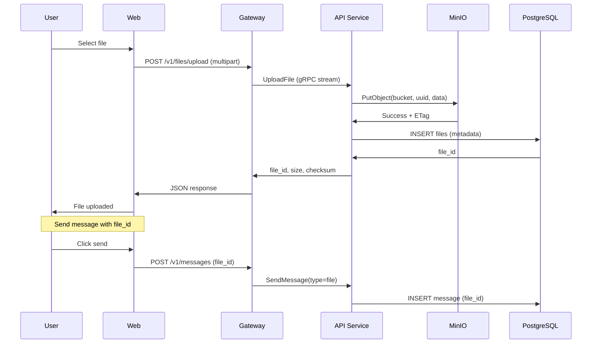

# Arquitetura Detalhada - Chat4All

## Especificações dos Componentes

### 1. Frontend (Angular 17)

**Tecnologia:** Angular 17 + TypeScript  
**Container:** chat4all-web  
**Porta:** 4200  
**Build:** Docker multi-stage (nginx)

**Responsabilidades:**
- Interface de usuário responsiva
- Gerenciamento de estado (RxJS)
- Autenticação JWT
- Comunicação REST com Gateway

**Estrutura:**
```
frontend/
├── src/
│   ├── app/
│   │   ├── components/      # UI Components
│   │   ├── services/        # API Services
│   │   ├── guards/          # Auth Guards
│   │   └── models/          # TypeScript Interfaces
│   └── environments/        # Config (dev/prod)
```

**Principais Features:**
- Login/Register forms
- Chat list view
- Message thread view
- File upload component
- Real-time message updates (polling)

---

### 2. API Gateway (PHP 8.3 + Nginx)

**Função:** Adaptador REST → gRPC  
**Container:** chat4all-gateway  
**Porta:** 8000  
**Pattern:** API Gateway Pattern

**Fluxo de Requisição:**
```
HTTP Request → Nginx → PHP-FPM → gRPC Client → API Service
```

**Endpoints Principais:**
```
POST   /v1/auth/register
POST   /v1/auth/login
GET    /v1/conversations
POST   /v1/conversations
GET    /v1/conversations/{id}/messages
POST   /v1/messages
POST   /v1/files/upload
GET    /v1/files/{id}
```

**Middleware:**
- CORS handling
- JWT validation
- Request logging
- Error handling

---

### 3. API Service (PHP 8.3 gRPC)

**Portas:**
- 8080: HTTP REST (callbacks)
- 50051: gRPC Server

**gRPC Services Implementados:**

#### AuthService
```protobuf
service AuthService {
  rpc Register(RegisterRequest) returns (AuthResponse);
  rpc Login(LoginRequest) returns (AuthResponse);
}
```

#### ConversationService
```protobuf
service ConversationService {
  rpc CreateConversation(CreateConversationRequest) returns (Conversation);
  rpc ListConversations(ListConversationsRequest) returns (ConversationList);
}
```

#### MessageService
```protobuf
service MessageService {
  rpc SendMessage(SendMessageRequest) returns (Message);
  rpc GetMessages(GetMessagesRequest) returns (MessageList);
}
```

**Kafka Producer:**
- Publica mensagens no tópico `messages`
- Serialização JSON
- Async não-bloqueante

**Database Layer:**
- PDO para PostgreSQL
- Prepared statements (SQL injection protection)
- Transaction support

---

### 4. PostgreSQL 16

**Schema Principal:**

```sql
-- Users Table
CREATE TABLE users (
    id UUID PRIMARY KEY DEFAULT uuid_generate_v4(),
    username VARCHAR(255) UNIQUE NOT NULL,
    email VARCHAR(255) UNIQUE NOT NULL,
    password_hash VARCHAR(255) NOT NULL,
    created_at TIMESTAMP DEFAULT NOW()
);

-- Conversations Table
CREATE TABLE conversations (
    id UUID PRIMARY KEY DEFAULT uuid_generate_v4(),
    name VARCHAR(255),
    type VARCHAR(20) CHECK (type IN ('private', 'group')),
    created_by UUID REFERENCES users(id),
    created_at TIMESTAMP DEFAULT NOW()
);

-- Participants Table (many-to-many)
CREATE TABLE conversation_participants (
    conversation_id UUID REFERENCES conversations(id),
    user_id UUID REFERENCES users(id),
    joined_at TIMESTAMP DEFAULT NOW(),
    PRIMARY KEY (conversation_id, user_id)
);

-- Messages Table
CREATE TABLE messages (
    id UUID PRIMARY KEY DEFAULT uuid_generate_v4(),
    conversation_id UUID REFERENCES conversations(id),
    sender_id UUID REFERENCES users(id),
    content TEXT,
    type VARCHAR(20) DEFAULT 'text',
    file_id UUID,
    status VARCHAR(20) DEFAULT 'SENT',
    created_at TIMESTAMP DEFAULT NOW()
);

-- Files Table
CREATE TABLE files (
    id UUID PRIMARY KEY DEFAULT uuid_generate_v4(),
    filename VARCHAR(255) NOT NULL,
    content_type VARCHAR(100),
    size_bytes BIGINT,
    checksum VARCHAR(64),
    storage_path VARCHAR(512),
    uploader_id UUID REFERENCES users(id),
    created_at TIMESTAMP DEFAULT NOW()
);
```

**Indexes:**
```sql
CREATE INDEX idx_messages_conversation ON messages(conversation_id);
CREATE INDEX idx_messages_sender ON messages(sender_id);
CREATE INDEX idx_messages_created ON messages(created_at DESC);
CREATE INDEX idx_participants_user ON conversation_participants(user_id);
```

**Connection Pool:**
- Max connections: 100
- ⚠️ Gargalo identificado: Precisa PgBouncer

---

### 5. Redis 7

**Uso Atual:**
- Session storage (JWT tokens)
- Cache de conversas recentes
- Rate limiting counters

**Data Structures:**
```redis
# Session
SET session:{user_id} {jwt_token} EX 3600

# Recent conversations cache
ZADD user:{user_id}:conversations {timestamp} {conversation_id}

# Rate limit
INCR ratelimit:{ip}:{endpoint} EX 60
```

**Configuração:**
- Maxmemory: 256MB
- Eviction policy: allkeys-lru
- Persistence: RDB (snapshot)

---

### 6. MinIO (Object Storage)

**S3-Compatible API**  
**Console:** http://localhost:9002  
**Credentials:** chat4all_admin / chat4all_minio_pass

**Bucket Structure:**
```
chat4all-files/
├── images/
│   ├── {uuid}.jpg
│   └── {uuid}.png
├── documents/
│   └── {uuid}.pdf
└── videos/
    └── {uuid}.mp4
```

**Upload Flow:**
```
Client → API → MinIO.putObject() → Store file
                    └→ Postgres.insert(metadata)
```

**Download Flow:**
```
Client → API → MinIO.presignedUrl(7d) → Return URL
Client → MinIO (direct) → Download file
```

**Limits:**
- Max file size: 2 GB
- Presigned URL expiry: 7 days
- Multipart upload: Enabled

---

### 7. Apache Kafka

**Cluster Configuration:**
- Broker ID: 1 (single broker dev)
- Zookeeper: localhost:2181
- Listeners:
  - PLAINTEXT://localhost:9092 (external)
  - INTERNAL://kafka:9093 (containers)

**Topics:**

```bash
# Main message topic
messages:
  partitions: 5
  replication-factor: 1
  retention.ms: 604800000  # 7 days

# Connector topics
whatsapp.messages:
  partitions: 3
  replication-factor: 1

instagram.messages:
  partitions: 3
  replication-factor: 1
```

**Consumer Groups:**
- `router-worker-group`: Main workers
- `whatsapp-connector-group`: WhatsApp mock
- `instagram-connector-group`: Instagram mock

**Partitioning Strategy:**
```
partition = hash(conversation_id) % num_partitions
```
Garante ordem de mensagens por conversação.

---

### 8. Router Workers

**Linguagem:** PHP 8.3  
**Kafka Consumer:** rdkafka extension

**Processamento:**
```php
while (true) {
    $message = $consumer->consume(120 * 1000);
    
    if ($message->err) continue;
    
    $payload = json_decode($message->payload);
    
    // Update message status
    $db->execute(
        "UPDATE messages SET status = 'DELIVERED' WHERE id = ?",
        [$payload->message_id]
    );
    
    // Route to connectors
    if ($payload->platform) {
        $producer->produce(
            "{$payload->platform}.messages",
            json_encode($payload)
        );
    }
    
    $consumer->commit($message);
}
```

**Escalabilidade:**
- Consumer group rebalancing automático
- Cada worker processa partições exclusivas
- Failover: <12s conforme testes

---

### 9. Connectors Mock

#### WhatsApp Connector

**Simula:** WhatsApp Business API  
**Container:** whatsapp-connector (escalável)  
**Linguagem:** PHP 8.3

**Fluxo:**
```
Kafka → Consume whatsapp.messages
      → Sleep(100-500ms)  # Simula envio
      → POST /v1/callbacks/whatsapp
         {message_id, status: "DELIVERED"}
      → Sleep(1-3s)
      → POST /v1/callbacks/whatsapp
         {message_id, status: "READ"}
```

**Features:**
- Delays realistas
- Exponential backoff em callbacks
- Webhook para mensagens recebidas

#### Instagram Connector

Idêntico ao WhatsApp, mas:
- Tópico: `instagram.messages`
- Callback URL: `/v1/callbacks/instagram`
- Delays diferentes (50-300ms)

---

### 10. Prometheus + Grafana

#### Prometheus

**Scrape Targets:**
```yaml
- job_name: 'chat4all-metrics'
  static_configs:
    - targets: ['metrics-exporter:8000']
      labels:
        cluster: 'chat4all'

- job_name: 'api-gateway'
  static_configs:
    - targets: ['api-gateway:9091']  # Future

- job_name: 'router-workers'
  dns_sd_configs:
    - names: ['router-worker']
      type: 'A'
      port: 9093
```

**Retention:** 15 days  
**Scrape Interval:** 15s

#### Grafana

**Datasources:**
- Prometheus (default)

**Dashboards:**
1. **System Overview:**
   - Messages processed (graph)
   - Throughput (gauge)
   - Latency percentiles (graph)
   - Error rate (graph)

2. **Resource Usage:**
   - CPU by service (graph)
   - Memory by service (graph)
   - Active workers (gauge)

**Refresh:** 5s  
**Time Range:** Last 1h (default)

---

## Fluxos de Dados

### Envio de Mensagem



### Upload de Arquivo



---

**Documento Técnico:** Arquitetura Chat4All  
**Versão:** 1.0  
**Data:** Novembro 2025
