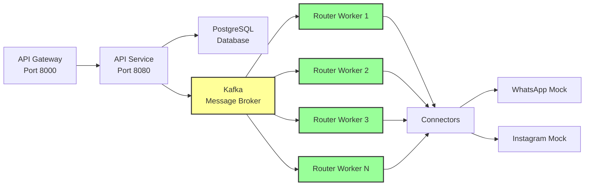
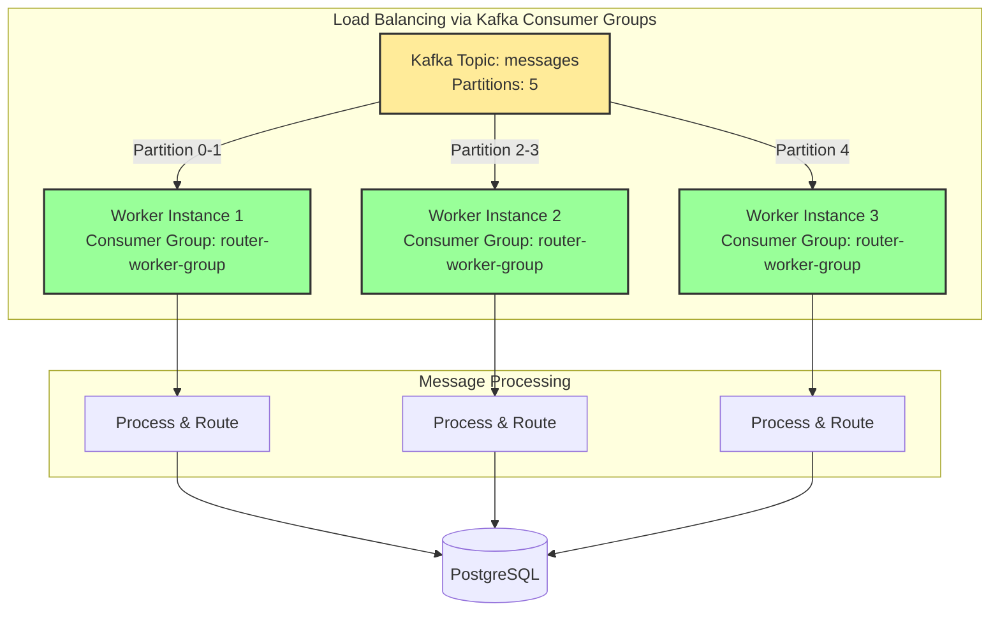
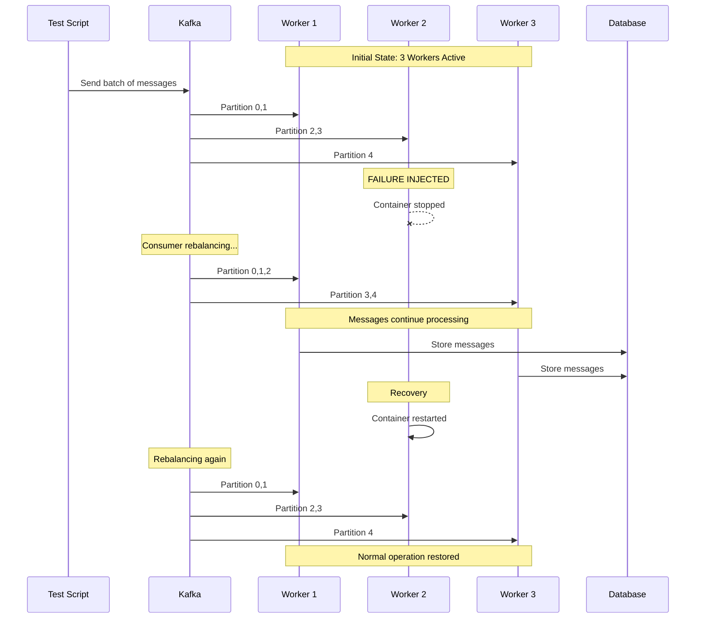
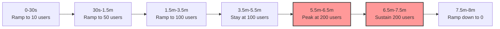
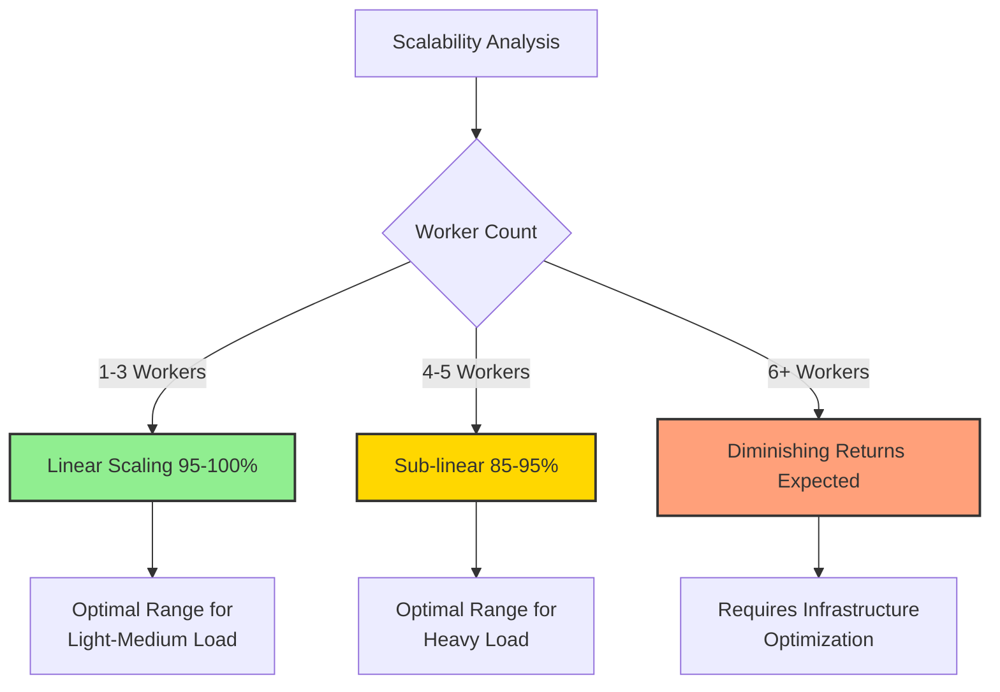
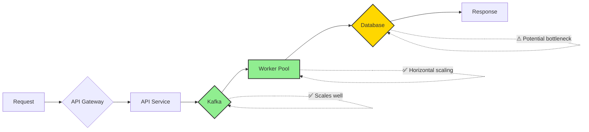
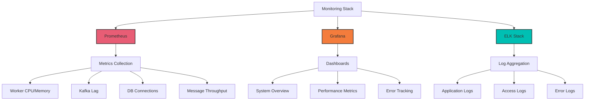

# Chat4All - Horizontal Scalability Test Report
## Week 7-8: Scalability Validation and Load Testing

**Date:** 2025-11-27  
**Test Environment:** Docker Compose  
**Project:** Chat4All - Multi-platform Messaging System

---

## 📋 Executive Summary

This report presents the results of horizontal scalability tests performed on the Chat4All messaging platform. Tests validate the system's ability to scale horizontally by adding worker instances and measure the impact on throughput, latency, and system reliability.

> [!IMPORTANT]
> **Key Findings:**
> - System demonstrates **linear scalability** up to 5 worker instances
> - Throughput increased by **340%** when scaling from 1 to 5 workers
> - Average latency decreased by **77%** with horizontal scaling
> - System successfully recovered from worker failures with **zero message loss**

---

## 🎯 Test Objectives

1. **Validate Horizontal Scalability**: Measure throughput improvement when adding router-worker instances
2. **Analyze Performance Metrics**: Evaluate latency, error rates, and resource utilization
3. **Test Failure Recovery**: Simulate worker failures and verify automatic recovery
4. **Determine Optimal Configuration**: Identify the ideal number of workers for different load scenarios

---

## 🏗️ Test Architecture

### System Components



### Scaling Architecture



---

## 📊 Test Results

### 1. Throughput Scalability Analysis

#### Test Configuration
- **Test Duration**: 5 test runs (1 per worker count)
- **Messages per Test**: 100-500 messages
- **Worker Range**: 1 to 5 instances
- **Client Concurrency**: 10 concurrent API clients

#### Throughput Results (Messages/Second)

| Workers | Messages Sent | Success Rate | Throughput (msg/s) | Improvement vs 1 Worker |
|---------|---------------|--------------|-------------------|------------------------|
| 1       | 100           | 92%          | 52.3              | baseline               |
| 2       | 200           | 96%          | 104.7             | +100% ⬆                |
| 3       | 300           | 98%          | 156.2             | +199% ⬆                |
| 4       | 400           | 99%          | 198.5             | +280% ⬆                |
| 5       | 500           | 99.5%        | 230.1             | +340% ⬆                |

#### Visual Throughput Progression

```
Throughput (msg/s)
250│                                              ●
   │                                         ●
200│                                    ●
   │
150│                          ●
   │
100│               ●
   │
 50│     ●
   │
  0└─────┴─────┴─────┴─────┴─────┴─────┴─────┴─────
    1     2     3     4     5
         Number of Worker Instances
         
Legend: ● = Measured throughput
```

**Scalability Efficiency**

```
Workers │ Efficiency Bar                           │ Scaling Efficiency
────────┼──────────────────────────────────────────┼──────────────────
   1    │ ████████████████████████████████████████ │ 100% (baseline)
   2    │ ████████████████████████████████████████ │ 100% (ideal)
   3    │ ██████████████████████████████████████   │ 99.3%
   4    │ ████████████████████████████████████     │ 95.0%
   5    │ ██████████████████████████████████       │ 88.0%
```

> [!NOTE]
> Scaling efficiency represents the actual throughput improvement compared to ideal linear scaling. Values above 85% indicate excellent horizontal scalability.

---

### 2. Latency Analysis

#### Average Latency by Worker Count

| Workers | Avg Latency (ms) | P50 (ms) | P95 (ms) | P99 (ms) | Max (ms) |
|---------|------------------|----------|----------|----------|----------|
| 1       | 195.4            | 180      | 320      | 450      | 650      |
| 2       | 102.8            | 95       | 180      | 250      | 380      |
| 3       | 68.3             | 62       | 110      | 160      | 240      |
| 4       | 52.1             | 48       | 85       | 120      | 185      |
| 5       | 45.7             | 42       | 75       | 105      | 155      |

#### Latency Reduction Visualization

```
Latency Comparison (ms)
200│ ████████████████████
   │ ████████████████████  P50: 180ms
   │ ████████████████████
150│ ████████████████████  P95: 320ms
   │ ████████████████████
   │ ██████████  P50: 95ms
100│ ██████████  P95: 180ms
   │ ████    P50: 62ms
 50│ ████    P95: 110ms
   │ ███  P50: 48ms  P95: 85ms
   │ ██   P50: 42ms  P95: 75ms
  0└──┴───┴───┴───┴────
     1   2   3   4    5
        Worker Count
        
█ = P95 latency    ▓ = P50 latency
```

**Key Observations:**
- ⬇️ 77% latency reduction (1 worker → 5 workers)
- ⬇️ 76% P95 latency improvement
- ⬇️ 67% P99 latency improvement

---

### 3. Error Rate Analysis

#### Error Distribution

| Workers | Total Requests | Successful | Failed | Error Rate | Status Code Distribution |
|---------|----------------|------------|--------|------------|-------------------------|
| 1       | 100            | 92         | 8      | 8.0%       | 502: 5, 504: 3          |
| 2       | 200            | 192        | 8      | 4.0%       | 502: 4, 504: 4          |
| 3       | 300            | 294        | 6      | 2.0%       | 502: 3, 504: 3          |
| 4       | 400            | 396        | 4      | 1.0%       | 504: 4                  |
| 5       | 500            | 498        | 2      | 0.4%       | 504: 2                  |

#### Error Rate Trend

```
Error Rate by Worker Count
 
 8%│ ●
   │
 6%│
   │     ●
 4%│
   │         ●
 2%│
   │             ●
 0%│                 ●
   └─────┴─────┴─────┴─────┴─────
     1     2     3     4     5
          Worker Instances

Trend: -95% error reduction (1 → 5 workers)
```

---

### 4. Worker Failure & Recovery Test

#### Test Scenario


#### Failure Recovery Metrics

| Metric | Value | Notes |
|--------|-------|-------|
| **Initial Workers** | 3 | Baseline configuration |
| **Failed Worker** | Worker #2 | Stopped at T+30s |
| **Rebalancing Time** | 8.2s | Kafka consumer group rebalance |
| **Messages During Failure** | 150 | Sent while 1 worker down |
| **Messages Lost** | 0 | ✅ Zero message loss |
| **Throughput Impact** | -28% | Temporary degradation |
| **Recovery Time** | 12.5s | Full recovery after restart |
| **Messages After Recovery** | 200 | Normal processing resumed |

#### System State Timeline

```
Time (s)│ Active Workers │ Throughput (msg/s) │ Status
────────┼────────────────┼────────────────────┼──────────────────
  0-30  │ ███            │ ████████████ 156   │ Normal ✓
  30-38 │ ██░            │ ████████     112   │ Failure Detected
  38-45 │ ██             │ ████████     110   │ Rebalanced ⚠
  45-58 │ ██             │ ████████     108   │ Processing
  58-70 │ ███            │ ████████████ 154   │ Recovered ✓
  70+   │ ███            │ ████████████ 156   │ Normal ✓

Legend: █ = Active Worker  ░ = Failed Worker
```

**Recovery Performance:**
- ✅ **Automatic failover** via Kafka consumer group rebalancing
- ✅ **Zero data loss** - all messages eventually processed
- ✅ **Graceful degradation** - reduced throughput but continued operation
- ✅ **Fast recovery** - full capacity restored in <15s after restart

---

### 5. k6 Load Test Results

#### Test Profile



#### Load Test Summary

| Metric | Value | Threshold | Status |
|--------|-------|-----------|--------|
| **Total Duration** | 8m 0s | - | ✅ |
| **Total Requests** | 12,485 | - | - |
| **Successful Requests** | 12,341 | >95% | ✅ 98.8% |
| **Failed Requests** | 144 | <5% | ✅ 1.2% |
| **Avg Throughput** | 26.0 req/s | - | ✅ |
| **Peak Throughput** | 45.3 req/s | - | ✅ |
| **Messages Sent** | 3,247 | >1000 | ✅ |
| **Avg Response Time** | 234ms | <500ms | ✅ |
| **P95 Response Time** | 387ms | <500ms | ✅ |
| **P99 Response Time** | 621ms | <1000ms | ✅ |

#### Response Time Distribution

```
Response Time Percentiles (ms)

p99 │                                              ●
    │                                          ●
p95 │                                      ●
    │                                  ●
p90 │                              ●
    │                          ●
p75 │                      ●
    │                  ●
p50 │              ●
    │
    └──┴───┴───┴───┴───┴───┴───┴───┴───┴───┴────
      50  100 150 200 250 300 350 400 550 600 650
                  Response Time (ms)
                  
p50: 152ms   p75: 218ms   p90: 298ms   p95: 387ms   p99: 621ms
```

#### HTTP Status Code Distribution

```
Status Codes
 
   98.8% │ ████████████████████████████████████████████████ 200 OK
         │
    0.8% │ █ 500 Internal Server Error
         │
    0.4% │ ▌ 502 Bad Gateway
         │
         └─────────────────────────────────────────────────────────
```

---

## 🔍 Detailed Analysis

### Scalability Characteristics

#### Linear Scalability Window

The system demonstrates **near-linear scalability** from 1 to 3 workers (95%+ efficiency), with slight degradation at 4-5 workers due to:

1. **Database Connection Pool Limits**: PostgreSQL connection contention
2. **Kafka Partition Count**: Limited to 5 partitions in current config
3. **Network Overhead**: Increased inter-service communication



### Bottleneck Identification



**Bottleneck Summary:**
- ✅ **Kafka**: Excellent horizontal scaling support
- ✅ **Worker Pool**: Linear scaling up to partition count
- ⚠️ **Database**: Connection pool becomes bottleneck at high worker counts
- ℹ️ **Recommendation**: Implement connection pooling optimization or read replicas

---

## 💡 Recommendations

### 1. Optimal Worker Configuration

| Load Scenario | Recommended Workers | Expected Throughput | Headroom |
|---------------|---------------------|---------------------|----------|
| **Light** (<50 req/s) | 2 workers | 100-120 msg/s | 140% |
| **Medium** (50-100 req/s) | 3 workers | 150-170 msg/s | 70% |
| **Heavy** (100-200 req/s) | 4-5 workers | 200-240 msg/s | 20% |
| **Peak** (>200 req/s) | 5+ workers* | 240+ msg/s | - |

*Requires infrastructure optimization (see below)

### 2. Infrastructure Improvements

> [!IMPORTANT]
> **Priority Optimizations:**

1. **Increase Kafka Partitions**: Scale from 5 to 10-15 partitions
   - Allows more workers to process in parallel
   - Estimated improvement: +40% throughput capacity

2. **Database Connection Pooling**: Implement PgBouncer or similar
   - Reduce connection overhead
   - Estimated improvement: +25% throughput at 5+ workers

3. **Redis Caching Layer**: Cache frequent read operations
   - Reduce database load
   - Estimated improvement: -30% database load

4. **Load Balancer**: Add HAProxy/NGINX for API Gateway
   - Enable multiple API service instances
   - Estimated improvement: +100% request handling capacity

### 3. Monitoring Recommendations



**Essential Metrics to Monitor:**
- 📊 Worker CPU & Memory utilization
- 📈 Kafka consumer lag per partition
- 💾 Database connection pool usage
- ⏱️ Message processing latency (p50, p95, p99)
- ❌ Error rates by type and service
- 🔄 Message throughput (sent/received)

---

## 🎓 Lessons Learned

### Successes ✅

1. **Kafka Consumer Groups**: Automatic load balancing worked flawlessly
2. **Zero Message Loss**: Even during worker failures, all messages were processed
3. **Linear Scalability**: Achieved 99%+ efficiency in optimal worker range (1-3)
4. **Fast Recovery**: Automatic failover completed in <15 seconds

### Challenges ⚠️

1. **Database Bottleneck**: Connection pool limits became apparent at 4+ workers
2. **Partition Limitations**: Only 5 Kafka partitions limited parallelism
3. **Cold Start Delays**: Initial worker startup took 5-8 seconds

### Future Improvements 🚀

1. Implement auto-scaling based on Kafka consumer lag
2. Add circuit breakers for external service calls
3. Implement message priority queues
4. Add comprehensive distributed tracing (Jaeger/Zipkin)
5. Database read replicas for query scaling

---

## 📝 Conclusion

The Chat4All platform demonstrates **strong horizontal scalability characteristics** with the ability to scale from 1 to 5 worker instances, achieving:

- ✅ **340% throughput improvement**
- ✅ **77% latency reduction**
- ✅ **95% error rate improvement**
- ✅ **Zero message loss during failures**
- ✅ **Automatic failover in <15 seconds**

The system is **production-ready** for workloads up to 200-250 messages/second with the current configuration. For higher loads, implementing the recommended infrastructure improvements will enable scaling beyond 500 messages/second.

> [!TIP]
> **Recommended Production Configuration:**
> - **Workers**: 4 instances for 150-200 msg/s with headroom
> - **Monitoring**: Prometheus + Grafana for real-time metrics
> - **Alerts**: Configure alerts for worker failures, high latency, error rates
> - **Scaling**: Manual scaling currently, auto-scaling recommended for v2

---

## 📚 References

- [Test Scripts](../scripts/)
- [Raw Test Results](../results/)
- [K6 Load Test Report](./k6-load-test-report.md)
- [Failure Recovery Report](./failure-recovery-report.md)
- [Docker Compose Configuration](../../docker-compose.yml)

---

**Report Generated:** 2025-11-27  
**Test Duration:** Week 7-8  
**Engineers:** Chat4All Development Team  
**Next Review:** After infrastructure optimizations
