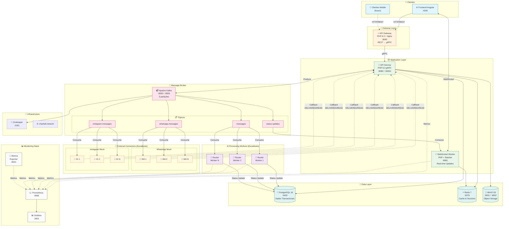
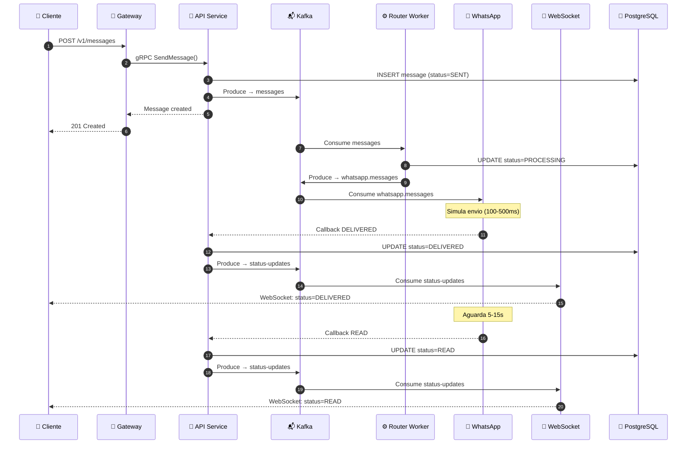
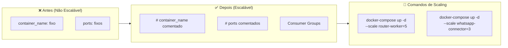
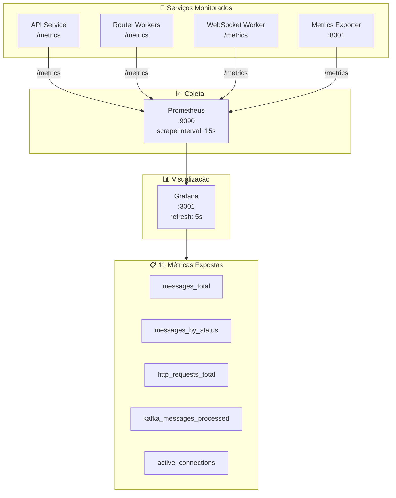

# Chat4All - Diagrama de Arquitetura

## 🏗️ Arquitetura Geral do Sistema

O diagrama abaixo representa a arquitetura distribuída do Chat4All, um sistema de mensagens instantâneas com escalabilidade horizontal, tolerância a falhas e comunicação baseada em eventos.



---

## 📋 Legenda dos Componentes

| Camada | Componente | Porta | Tecnologia | Função |
|--------|------------|-------|------------|--------|
| **Cliente** | Frontend Angular | 4200 | Angular 17 | Interface web responsiva |
| **Gateway** | API Gateway | 8000 | PHP 8.3 + Nginx | Adaptador REST ↔ gRPC |
| **Aplicação** | API Service | 8080/50051 | PHP 8.3 gRPC | Serviços de negócio |
| **Aplicação** | WebSocket Worker | 8081 | PHP + Ratchet | Notificações real-time |
| **Broker** | Apache Kafka | 9092/9093 | Kafka 7.5 | Message streaming |
| **Workers** | Router Workers | - | PHP 8.3 | Processamento assíncrono |
| **Connectors** | WhatsApp/Instagram | - | PHP 8.3 | Integração externa (mock) |
| **Dados** | PostgreSQL | 5432 | PostgreSQL 16 | Dados transacionais |
| **Dados** | Redis | 6379 | Redis 7 | Cache e sessões |
| **Dados** | MinIO | 9001/9002 | MinIO S3 | Armazenamento de arquivos |
| **Monitoramento** | Prometheus | 9090 | Prometheus | Coleta de métricas |
| **Monitoramento** | Grafana | 3001 | Grafana | Dashboards |

---

## 🔄 Fluxo de Mensagens



---

## 🚀 Escalabilidade Horizontal



### Componentes Escaláveis

| Componente | Min | Max Testado | Consumer Group |
|------------|-----|-------------|----------------|
| Router Workers | 1 | 5 | `router-worker-group` |
| WhatsApp Connector | 1 | 3 | `whatsapp-connector-group` |
| Instagram Connector | 1 | 3 | `instagram-connector-group` |

---

## 📊 Stack de Monitoramento



---

## 🏛️ Padrões Arquiteturais Utilizados

| Padrão | Aplicação no Chat4All |
|--------|----------------------|
| **API Gateway** | Gateway único para todos os clientes |
| **Microservices** | Serviços independentes e desacoplados |
| **Event-Driven** | Comunicação assíncrona via Kafka |
| **CQRS** | Separação de leitura/escrita |
| **Consumer Groups** | Balanceamento automático de carga |
| **Polyglot Persistence** | PostgreSQL + Redis + MinIO |
| **Circuit Breaker** | Tolerância a falhas nos connectors |

---

## 🐳 Containers Docker

```
┌─────────────────────────────────────────────────────────────────────┐
│                        chat4all-network                              │
├─────────────────────────────────────────────────────────────────────┤
│                                                                      │
│  ┌──────────────┐  ┌──────────────┐  ┌──────────────┐              │
│  │ chat4all-web │  │chat4all-gate │  │ chat4all-api │              │
│  │    :4200     │  │    :8000     │  │  :8080/:50051│              │
│  └──────────────┘  └──────────────┘  └──────────────┘              │
│                                                                      │
│  ┌──────────────┐  ┌──────────────┐  ┌──────────────┐              │
│  │chat4all-ws   │  │ chat4all-    │  │ chat4all-    │              │
│  │   :8081      │  │  postgres    │  │    redis     │              │
│  └──────────────┘  │    :5432     │  │    :6379     │              │
│                    └──────────────┘  └──────────────┘              │
│                                                                      │
│  ┌──────────────┐  ┌──────────────┐  ┌──────────────┐              │
│  │ chat4all-    │  │ chat4all-    │  │ chat4all-    │              │
│  │    minio     │  │    kafka     │  │  zookeeper   │              │
│  │ :9001/:9002  │  │ :9092/:9093  │  │    :2181     │              │
│  └──────────────┘  └──────────────┘  └──────────────┘              │
│                                                                      │
│  ┌──────────────┐  ┌──────────────┐  ┌──────────────┐              │
│  │ router-      │  │  whatsapp-   │  │  instagram-  │              │
│  │  worker (N)  │  │connector (N) │  │connector (N) │              │
│  └──────────────┘  └──────────────┘  └──────────────┘              │
│                                                                      │
│  ┌──────────────┐  ┌──────────────┐  ┌──────────────┐              │
│  │ chat4all-    │  │ chat4all-    │  │ chat4all-    │              │
│  │  prometheus  │  │   grafana    │  │   metrics    │              │
│  │    :9090     │  │    :3001     │  │    :8001     │              │
│  └──────────────┘  └──────────────┘  └──────────────┘              │
│                                                                      │
└─────────────────────────────────────────────────────────────────────┘
```

---

> **Nota:** Os diagramas Mermaid são renderizados automaticamente em plataformas compatíveis como GitHub, GitLab, VS Code (com extensão) e diversas ferramentas de documentação.
